# readme-term

Animated Homebrew-style terminal for a GitHub profile README. Fill in **`config.json`**, generate the SVG, drop it on your profile.

<p align="center">
  
</p>

The preview is generic on purpose (`your_handle`, `your city`, birthday `2000-01-01`). Swap every example value for yours.

## Setup

1. Click **Use this template** and create a **public** repo.
2. Edit [`config.json`](config.json) — at least `window`, `whoami`, brew `packages`, and `profile`.
3. For a living `human` version, set `brew.packages[].version.birthday` to a real `YYYY-MM-DD`.
4. Enable the daily Action (see **Cron** below) or run locally:

```
python3 generate.py
```

Python **3.10+**. No packages to install.

5. Put this in your profile README (`username/username`):

```
<p align="center">
  
</p>
```

If `readme-term` *is* the profile repo, use `src="assets/boot.svg"`.

## Cron (GitHub Actions)

The workflow [`.github/workflows/generate.yml`](.github/workflows/generate.yml) redraws `assets/boot.svg` and commits it when something changed (age/month versions, or you edited `config.json`).

GitHub **does not run scheduled workflows on a brand-new template copy** until Actions are allowed.

1. Repo **Settings → Actions → General**.
2. Under *Actions permissions*, allow Actions (default: *Allow all actions and reusable workflows*).
3. Under *Workflow permissions*, **Read and write** — the job must push `assets/boot.svg`.
4. Open the **Actions** tab. If GitHub asks, click **I understand my workflows, go ahead and enable them**.
5. **Generate terminal SVG → Run workflow** once, so you know the token and permissions work.
6. Leave the `schedule` in place. Default:

```
0 0 * * *
```

That is **00:00 UTC every day**. GitHub can delay a scheduled job by minutes or hours. It will not fire if Actions stay disabled.

### Change the time

Edit the `cron:` line in `.github/workflows/generate.yml`. GitHub cron is always UTC.

| When | cron |
| --- | --- |
| Every day at 00:00 UTC | `0 0 * * *` |
| Every day at 03:00 São Paulo (UTC−3) | `0 6 * * *` |
| First day of each month, 00:00 UTC | `0 0 1 * *` |
| Only by hand (no schedule) | delete the `schedule:` block, keep `workflow_dispatch` |

Daily is the right default if you use `type: age` or `type: anniversary` versions (the patch is months since a birthday). A monthly cron still works; the SVG just updates later.

### Turn it off

Delete `.github/workflows/generate.yml` and generate only on your machine with `python3 generate.py`.

## `config.json`

| Block | What to change |
| --- | --- |
| `window` | Title in the traffic-light bar (`you@github ~ /profile`) |
| `whoami` | Output of `$ whoami` |
| `boot` | `./boot.sh` steps (`key` / `value`) and the gold `ready` line |
| `brew.packages` | Formulae: `name`, `version`, optional `note` |
| `brew.keg_only` | Grey line under the beer summary (omit the key to hide it) |
| `profile` | The `cat you.ts` object |

### Package extras

`version` is either a pin (`"1.0.0"`) or a living semver:

- `{ "type": "age", "birthday": "2000-01-01" }` — years as `X.Y`, months since last birthday as `Z` (replace the date)
- `{ "type": "anniversary", "month": 10, "day": 25, "version": "1.0.0", "as_of_year": 2025 }` — same monthly patch, `+0.1` on that date each year

`effect` (optional): `stall` (hangs at `stall_at`, default 87), `reverse` (fill from the right), `bursts` (jumps).

`ribbon: true` draws a small orange awareness bow instead of a text note.

Omit `boot`, `brew`, or `profile` if you do not want that act.

## License

MIT. Original profile: [github.com/flippelt](https://github.com/flippelt).
